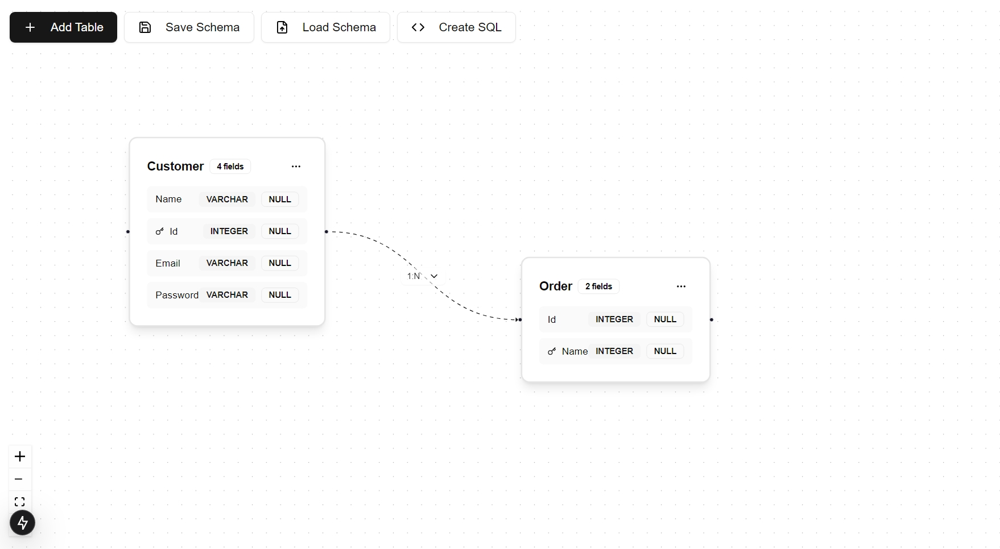

# SQL Schema Creator

The **SQL Schema Creator** is a web-based tool built with Next.js that allows users to design database schemas easily. This tool provides an intuitive interface for:

- Creating and editing database tables.
- Establishing relationships between tables.
- Defining keys (primary, foreign, etc.).
- Generating SQL code for the designed schema.
- Exporting and importing the schema in JSON format for seamless collaboration and reusability.

## Features

- **Table Management**: Create, edit, and delete tables with ease.
- **Relationship Support**: Connect tables with relationships such as one-to-one, one-to-many, and many-to-many.
- **Key Management**: Define primary keys, foreign keys, and other constraints.
- **JSON Support**:
  - Download the schema as a JSON file.
  - Upload a JSON file to resume work.
- **SQL Code Generation**: Get the SQL script for the schema you've created.

## Technologies Used

- **Next.js**: Framework for building the application.
- **React Flow**: For visualizing and managing the schema design interface.
- **UUID**: For generating unique identifiers for tables and relationships.

## Preview

<div align="center">
  
</div>

## Getting Started

Follow these steps to clone and run the project locally:

### Prerequisites

Ensure you have the following installed on your machine:

- [Node.js](https://nodejs.org/) (v14 or later)
- [npm](https://www.npmjs.com/) or [yarn](https://yarnpkg.com/)

### Installation

1. Clone the repository:

   ```bash
   git clone https://github.com/AzibMoeen/react-flow.git
   ```

2. Navigate to the project directory:

   ```bash
   cd react-flow
   ```

3. Install dependencies:

   Using npm:
   ```bash
   npm install
   ```

   Or using yarn:
   ```bash
   yarn install
   ```

4. Start the development server:

   Using npm:
   ```bash
   npm run dev
   ```

   Or using yarn:
   ```bash
   yarn dev
   ```

5. Open your browser and go to:

   ```
   http://localhost:3000
   ```

## Usage

1. Use the interface to create tables and define their properties.
2. Connect tables to establish relationships.
3. Use the export feature to download your schema as a JSON file.
4. Use the import feature to upload a previously exported JSON file and continue working.
5. Generate SQL code for your schema with a single click.


Enjoy designing your database schemas with ease!

